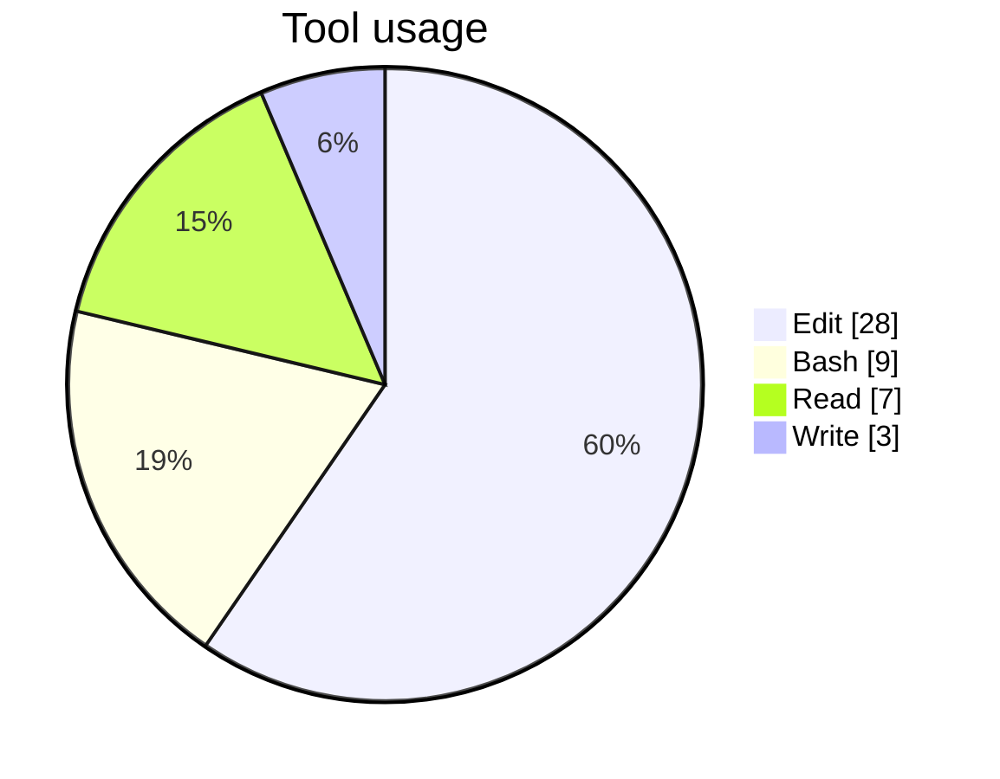
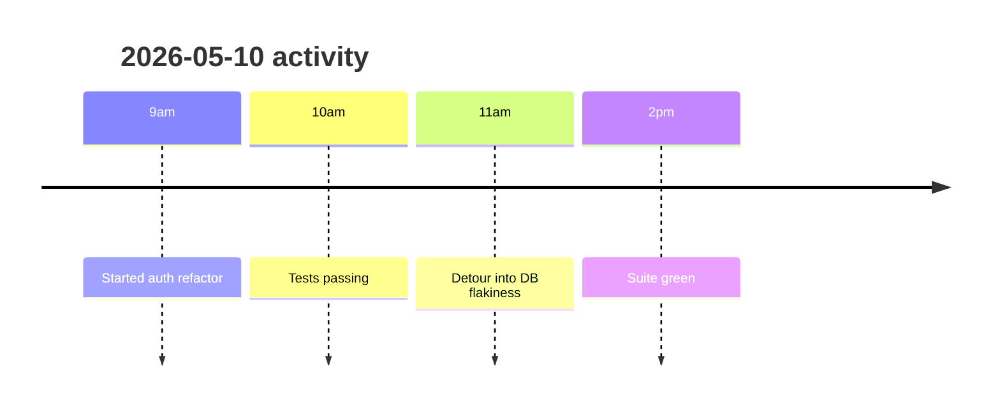

# vibelog

> Auto-logs your AI coding activity across **Claude Code**, **Codex CLI**, and **Cursor**, then on-demand generates a markdown summary of every AI-assisted change you made — with mermaid charts, decision log, and timeline.

Two slash commands (Claude Code):

| Command | Purpose |
|---|---|
| `/vibein <focus>` | Declare what you're working on today |
| `/vibeout [YYYY-MM-DD]` | Generate the daily summary report (defaults to today) |

**Logging is always-on the moment hooks are installed. It does not depend on `/vibein`.** Every prompt and tool call from any of the three platforms is appended to a single shared JSONL file at `~/.vibelog/logs/<date>.jsonl`, tagged with a `platform` field so you can tell which agent did what. If you forget `/vibeout`, your data is still there and you can summarize any past day later.

## Platform support

| Platform | Auto-log prompts | Auto-log tool calls | `/vibein` + `/vibeout` slash commands |
|---|---|---|---|
| **Claude Code** | ✓ via `UserPromptSubmit` hook | ✓ via `PostToolUse` (all tools) | ✓ |
| **Codex CLI** (1.x, hooks experimental) | ✓ via `UserPromptSubmit` | ✓ via `PostToolUse` | not yet — Codex doesn't document custom slash commands inside plugins |
| **Cursor** (≥ 1.7) | ✓ via `beforeSubmitPrompt` | ✓ via `postToolUse` | not yet |

For Codex/Cursor you still get the always-on logging — you just need to run `/vibeout` from a Claude Code session to generate the summary. (Or run `jq` over `~/.vibelog/logs/<date>.jsonl` yourself.)

---

## What you get

Every prompt, tool call, and session boundary is appended to a single JSONL file per day. When you run `/vibeout`, Claude reads that file and produces a report like:

```markdown
# vibelog — 2026-05-10

## Today's intent
- finish the auth refactor

## Summary
Spent ~2h on the auth middleware: refactored the token-expiry check, added 14
unit tests, ran the full suite four times. One detour into a flaky DB
connection bug. 17 prompts total, 28 Edit calls, 9 Bash runs.

## Tool usage


## Timeline


## Files touched
- src/auth/middleware.ts
- src/auth/middleware.test.ts
- src/db/pool.ts

## Decision log
- 09:14 — Refactored token expiry from `<` to `<=` after spotting an off-by-one
  in the integration tests. Reasoning: tokens at exactly `now()` were rejected.
- 10:42 — Added 14 unit tests covering boundary conditions. Reasoning: the
  expiry check now has 3 branches and prior coverage was 1.
- 11:17 — Side-quest: flaky DB pool error. Bumped pool size from 5 → 10.
```

---

## Install

You can install platforms independently. **Claude Code** uses its plugin marketplace; **Codex** and **Cursor** use a one-shot `install.sh` that writes user-level hook configs.

### Claude Code

```text
/plugin marketplace add gcharan199/vibelog
/plugin install vibelog@vibelog
/reload-plugins
```

Hooks fire on the next prompt.

### Codex CLI + Cursor (one script for both)

```bash
git clone https://github.com/gcharan199/vibelog.git ~/vibelog
cd ~/vibelog
./install.sh
```

`install.sh` detects which platforms are present and writes:
- `~/.codex/hooks.json` (if Codex is installed) — with absolute paths to this clone
- `~/.cursor/hooks.json` (if Cursor is installed) — same

Existing files are backed up to `<file>.vibelog-backup-<timestamp>` before overwrite. Re-run safely.

**Codex extra step (one-time):** Codex hooks are flagged experimental. Add this to `~/.codex/config.toml`:

```toml
[features]
codex_hooks = true
```

**Cursor extra step:** restart Cursor (or reload window) so it picks up the new hooks. Requires Cursor ≥ 1.7.

### What if I clone somewhere other than `~/vibelog`?

`install.sh` resolves its own absolute path at runtime, so any clone location works. Just `cd` into the repo before running it.

### Manual install (skip `install.sh`)

If you'd rather not run the script:

1. Copy `.codex/hooks.json` to `~/.codex/hooks.json` and replace `__VIBELOG_ROOT__` with your absolute clone path.
2. Same for `.cursor/hooks.json` → `~/.cursor/hooks.json`.
3. Apply the Codex feature flag noted above.

### Claude Code: local-clone install

For development of this plugin itself:

```text
/plugin marketplace add /absolute/path/to/vibelog
/plugin install vibelog@vibelog
/reload-plugins
```

---

## Usage

```text
/vibein finishing the auth flow
```

Appends an `intent` event to today's log. The intent shows up at the top of the eventual report.

```text
/vibeout
```

Reads today's log at `~/.vibelog/logs/<today>.jsonl`, computes stats with `jq`, and writes a six-section markdown report to `~/.vibelog/reports/<today>.md`. Sections:

1. **Today's intent** — what you said in `/vibein` (or "(no /vibein run today)")
2. **Summary** — one-paragraph factual recap
3. **Tool usage** — mermaid pie chart, sorted by count
4. **Timeline** — mermaid timeline of major activities by hour
5. **Files touched** — every Edit / Write / MultiEdit / NotebookEdit target
6. **Decision log** — what Claude did, with the inferred reasoning per significant action

```text
/vibeout 2026-05-08
```

Same, for any past date that has a log file. Idempotent — re-running overwrites the report.

---

## How it works

```
  ┌────────────────┐  ┌────────────┐  ┌──────────┐
  │ Claude Code    │  │ Codex CLI  │  │ Cursor   │
  └───────┬────────┘  └─────┬──────┘  └────┬─────┘
          │                 │              │
          │ each platform's hook events    │
          ▼                 ▼              ▼
  ┌──────────────────────────────────────────────┐
  │  hooks/*.sh   (POSIX bash, shared by all 3)  │
  │  • $1 = platform identifier                  │
  │  • read JSON event from stdin                │
  │  • append 1 JSONL line, exit 0 (never block) │
  └──────────────────────┬───────────────────────┘
                         ▼
        ~/.vibelog/logs/YYYY-MM-DD.jsonl
        (one shared append-only log per day,
         every line has a `platform` field)
                         │
                         │  /vibeout invoked (Claude Code)
                         ▼
  ┌──────────────────────────┐
  │  commands/vibeout.md     │
  │  • jq stats over JSONL   │
  │  • render mermaid + prose│
  └────────────┬─────────────┘
               ▼
        ~/.vibelog/reports/YYYY-MM-DD.md
```

The bash scripts work identically across all three platforms because their stdin event JSON has the same field names (`prompt`, `tool_name`, `tool_input`). The platform identifier is passed as `$1` from each platform's `hooks.json` so each event line gets `"platform": "claude-code"|"codex"|"cursor"`.

### Hook → event mapping

| Script | Claude Code event | Codex event | Cursor event |
|---|---|---|---|
| [log-prompt.sh](hooks/log-prompt.sh) | `UserPromptSubmit` | `UserPromptSubmit` | `beforeSubmitPrompt` |
| [log-tool-use.sh](hooks/log-tool-use.sh) | `PostToolUse` (all tools) | `PostToolUse` (`.*`) | `postToolUse` |
| [log-stop.sh](hooks/log-stop.sh) | `Stop` | `Stop` | `stop` |
| [session-start.sh](hooks/session-start.sh) | `SessionStart` | `SessionStart` | `sessionStart` |
| [session-end.sh](hooks/session-end.sh) | `SessionEnd` | _(none — Codex has no SessionEnd; uses Stop)_ | `sessionEnd` |

Each script appends one of `{event:"user_prompt", text}`, `{event:"tool_use", tool, summary}` (string fields truncated to 500 chars), `{event:"turn_end"}`, `{event:"session_start"}`, or `{event:"session_end"}` — every line additionally has `ts` (UTC ISO8601) and `platform`. `/vibein` adds a sixth event type, `{event:"intent", text}`.

### File layout

| Path | Contents |
|---|---|
| `<repo>/.claude-plugin/plugin.json` | Claude Code plugin manifest |
| `<repo>/.claude-plugin/marketplace.json` | Claude Code marketplace manifest |
| `<repo>/hooks/hooks.json` | Claude Code hook → script mapping (uses `${CLAUDE_PLUGIN_ROOT}`) |
| `<repo>/.codex/hooks.json` | Codex hook → script mapping (template; `__VIBELOG_ROOT__` substituted by `install.sh`) |
| `<repo>/.cursor/hooks.json` | Cursor hook → script mapping (template; flat schema, camelCase) |
| `<repo>/hooks/*.sh` | Hook scripts (POSIX bash, `jq`-first with python3 fallback) — shared by all 3 platforms |
| `<repo>/commands/vibein.md` | `/vibein` slash command (Claude Code) |
| `<repo>/commands/vibeout.md` | `/vibeout` slash command (Claude Code) |
| `<repo>/install.sh` | One-shot installer for Codex + Cursor user-level configs |
| `~/.codex/hooks.json` | Generated by `install.sh` |
| `~/.cursor/hooks.json` | Generated by `install.sh` |
| `~/.vibelog/logs/YYYY-MM-DD.jsonl` | Append-only event log (shared across all platforms) |
| `~/.vibelog/reports/YYYY-MM-DD.md` | Generated reports |

Plugin code (under `<repo>/`) and your data (under `~/.vibelog/`) are intentionally separated. Reinstalling, updating, or deleting the plugin does not touch your data.

---

## Privacy & security

> ### Logs are unredacted plaintext — never share them raw
>
> **API keys, env vars, file contents, and tokens** that pass through `Bash`, `Edit`, `Write`, and other tool calls **WILL** be written to `~/.vibelog/logs/<date>.jsonl`. The 500-character truncation on tool inputs reduces blast radius but **does not redact secrets**.
>
> **Never commit these logs to git or share them without scrubbing first.** Treat `~/.vibelog/` as sensitive — same posture as `.env` files. Add it to your global gitignore if there's any chance you'd commit it accidentally:
>
> ```bash
> echo '.vibelog/' >> ~/.config/git/ignore
> ```

No telemetry. No network calls. Everything stays in `~/.vibelog/` on your machine.

---

## Troubleshooting

### Hooks not firing

**Claude Code:**
1. Restart Claude Code after install — hooks load at session start.
2. Confirm the plugin is registered: `jq '.plugins | keys' ~/.claude/plugins/installed_plugins.json` should include `vibelog@vibelog`.
3. Confirm the marketplace is known: `jq 'keys' ~/.claude/plugins/known_marketplaces.json` should include `vibelog`.

**Codex CLI:**
1. Did you set `codex_hooks = true` under `[features]` in `~/.codex/config.toml`? Hooks are gated behind this experimental flag.
2. Confirm the file exists: `ls -la ~/.codex/hooks.json`.
3. Confirm paths inside it are absolute (no `__VIBELOG_ROOT__` placeholders): `grep VIBELOG ~/.codex/hooks.json` should print nothing.

**Cursor:**
1. Did you restart Cursor after install? Hooks load at app start.
2. Confirm Cursor version: must be ≥ 1.7.
3. Confirm `~/.cursor/hooks.json` exists with absolute paths.

**All platforms:**
- Check the executable bit on hook scripts: `ls -l <repo>/hooks/*.sh` (all should be `-rwxr-xr-x`).
- Test a hook directly without going through any agent:
   ```bash
   echo '{"prompt":"test"}' | bash <repo>/hooks/log-prompt.sh claude-code \
     && cat ~/.vibelog/logs/$(date +%Y-%m-%d).jsonl
   ```

### `jq: command not found`

Hooks prefer `jq` and fall back to `python3`. If neither is installed, hooks still exit 0 (never block Claude) but events won't be recorded. Install:

```bash
brew install jq        # macOS
sudo apt install jq    # Debian/Ubuntu
```

### Stop-hook infinite loop

Not possible with this plugin — `log-stop.sh` only appends and exits 0. It never returns exit code 2 (which would force Claude to continue). If you fork the plugin, preserve that invariant.

### `vibelog: unsummarized days found: ...` at session start

That's the plugin reminding you of past days that have logs but no report. Run `/vibeout YYYY-MM-DD` for each.

### Log files getting huge

Out of scope for v0.1.0. If a single day's log exceeds ~10 MB, trim manually:

```bash
head -n 10000 ~/.vibelog/logs/2026-05-10.jsonl > /tmp/trimmed.jsonl \
  && mv /tmp/trimmed.jsonl ~/.vibelog/logs/2026-05-10.jsonl
```

### `jq -Rs` produces multi-line JSON

You're looking at an outdated copy — current code uses `jq -cRs` (compact). If you forked an old version and JSONL parsing breaks, add `-c`.

---

## Contributing

Pull requests welcome. Before submitting:

1. `bash -n` passes for every `.sh`
2. `jq .` passes for every `.json`
3. Hooks must always `exit 0` — never block Claude Code
4. `log-stop.sh` must remain trivial (append + exit 0)
5. Don't introduce dependencies beyond `jq` + `python3` + bash

To test changes locally without reinstalling:

```bash
echo '{"prompt":"test"}' | bash hooks/log-prompt.sh
echo '{"tool_name":"Bash","tool_input":{"command":"ls"}}' | bash hooks/log-tool-use.sh
```

---

## License

MIT — see [LICENSE](LICENSE).

v0.1.0. Personal-use activity log — no warranty, no telemetry, all data stays on your machine.
