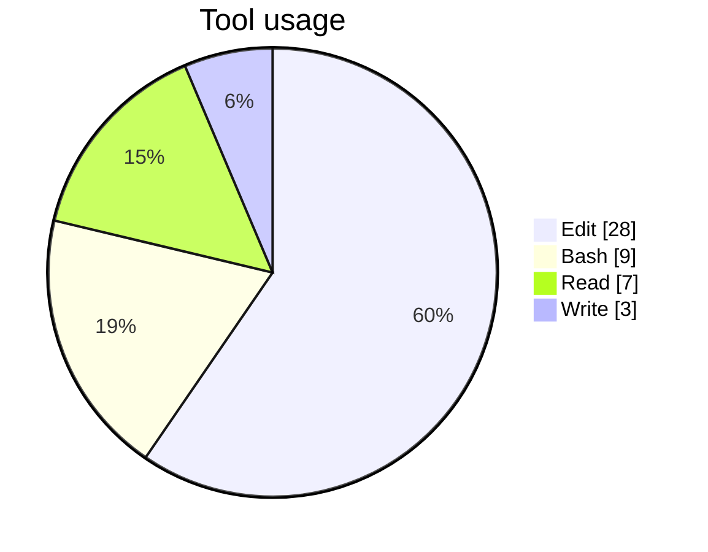
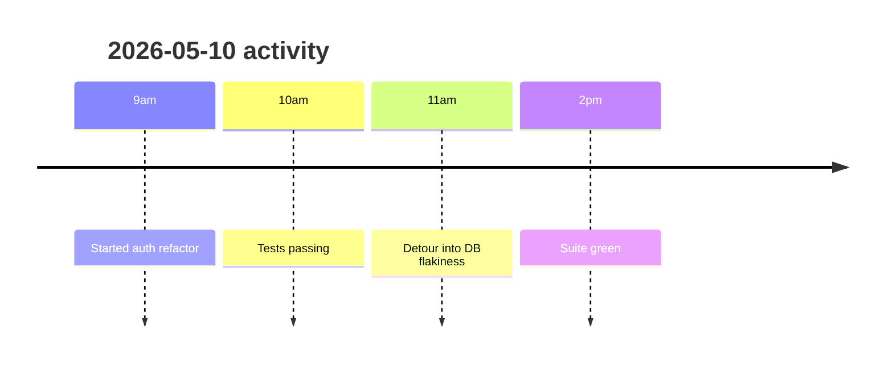

# vibelog

> Auto-logs your Claude Code activity all day, then on-demand generates a markdown summary of every AI-assisted change you made — with mermaid charts, decision log, and timeline.

A Claude Code plugin. Two slash commands:

| Command | Purpose |
|---|---|
| `/vibein <focus>` | Declare what you're working on today |
| `/vibeout [YYYY-MM-DD]` | Generate the daily summary report (defaults to today) |

**Logging is always-on the moment the plugin is installed. It does not depend on `/vibein`.** Raw events are written to an append-only JSONL file. If you forget `/vibeout`, your data is still there and you can summarize any past day later.

---

## What you get

Every prompt, tool call, and session boundary is appended to a single JSONL file per day. When you run `/vibeout`, Claude reads that file and produces a report like:

```markdown
# vibelog — 2026-05-10

## Today's intent
- finish the auth refactor

## Summary
Spent ~2h on the auth middleware: refactored the token-expiry check, added 14
unit tests, ran the full suite four times. One detour into a flaky DB
connection bug. 17 prompts total, 28 Edit calls, 9 Bash runs.

## Tool usage


## Timeline


## Files touched
- src/auth/middleware.ts
- src/auth/middleware.test.ts
- src/db/pool.ts

## Decision log
- 09:14 — Refactored token expiry from `<` to `<=` after spotting an off-by-one
  in the integration tests. Reasoning: tokens at exactly `now()` were rejected.
- 10:42 — Added 14 unit tests covering boundary conditions. Reasoning: the
  expiry check now has 3 branches and prior coverage was 1.
- 11:17 — Side-quest: flaky DB pool error. Bumped pool size from 5 → 10.
```

---

## Install

### From GitHub

```text
/plugin marketplace add gcharan199/vibelog
/plugin install vibelog@vibelog
/reload-plugins
```

Hooks fire on the next prompt.

### From a local clone (development)

```bash
git clone https://github.com/gcharan199/vibelog.git
cd vibelog
```

Then in any Claude Code session:

```text
/plugin marketplace add /absolute/path/to/vibelog
/plugin install vibelog@vibelog
/reload-plugins
```

### Manual fallback — register in the JSON files yourself

If the slash-command flow errors on your Claude Code version:

```bash
PLUGIN_DIR="$(pwd)"   # absolute path to your clone of this repo

# 1. Place (or symlink) the plugin dir under ~/.claude/plugins/marketplaces/
mkdir -p ~/.claude/plugins/marketplaces
ln -sfn "$PLUGIN_DIR" ~/.claude/plugins/marketplaces/vibelog

INSTALL_LOC="$HOME/.claude/plugins/marketplaces/vibelog"

# 2. Register the marketplace
jq --arg p "$PLUGIN_DIR" --arg i "$INSTALL_LOC" \
  '. + {"vibelog": {"source": {"source": "local", "path": $p}, "installLocation": $i, "lastUpdated": (now|todate)}}' \
  ~/.claude/plugins/known_marketplaces.json > /tmp/km.json && mv /tmp/km.json ~/.claude/plugins/known_marketplaces.json

# 3. Register the plugin install
jq --arg i "$INSTALL_LOC" \
  '.plugins["vibelog@vibelog"] = [{"scope":"user","installPath":$i,"version":"0.1.0","installedAt":(now|todate),"lastUpdated":(now|todate)}]' \
  ~/.claude/plugins/installed_plugins.json > /tmp/ip.json && mv /tmp/ip.json ~/.claude/plugins/installed_plugins.json
```

Restart Claude Code.

---

## Usage

```text
/vibein finishing the auth flow
```

Appends an `intent` event to today's log. The intent shows up at the top of the eventual report.

```text
/vibeout
```

Reads today's log at `~/.claude/vibelog/logs/<today>.jsonl`, computes stats with `jq`, and writes a six-section markdown report to `~/.claude/vibelog/reports/<today>.md`. Sections:

1. **Today's intent** — what you said in `/vibein` (or "(no /vibein run today)")
2. **Summary** — one-paragraph factual recap
3. **Tool usage** — mermaid pie chart, sorted by count
4. **Timeline** — mermaid timeline of major activities by hour
5. **Files touched** — every Edit / Write / MultiEdit / NotebookEdit target
6. **Decision log** — what Claude did, with the inferred reasoning per significant action

```text
/vibeout 2026-05-08
```

Same, for any past date that has a log file. Idempotent — re-running overwrites the report.

---

## How it works

```
  ┌──────────────────────────┐
  │   Claude Code session    │
  └────┬─────────────────────┘
       │ events (UserPromptSubmit, PostToolUse, Stop, SessionStart, SessionEnd)
       ▼
  ┌──────────────────────────┐
  │  hooks/*.sh (this plugin)│
  │  • read JSON from stdin  │
  │  • append 1 JSONL line   │
  │  • exit 0 (never block)  │
  └────┬─────────────────────┘
       │
       ▼
  ~/.claude/vibelog/logs/YYYY-MM-DD.jsonl   (append-only)
       │
       │  /vibeout invoked
       ▼
  ┌──────────────────────────┐
  │  commands/vibeout.md     │
  │  • jq stats over JSONL   │
  │  • render mermaid + prose│
  └────┬─────────────────────┘
       ▼
  ~/.claude/vibelog/reports/YYYY-MM-DD.md
```

**Five hooks** (defined in [hooks/hooks.json](hooks/hooks.json)):

| Hook | Script | What it logs |
|---|---|---|
| `UserPromptSubmit` | [log-prompt.sh](hooks/log-prompt.sh) | `{event:"user_prompt", text}` |
| `PostToolUse` (all tools) | [log-tool-use.sh](hooks/log-tool-use.sh) | `{event:"tool_use", tool, summary}` (string fields truncated to 500 chars) |
| `Stop` | [log-stop.sh](hooks/log-stop.sh) | `{event:"turn_end"}` — append + exit 0, never returns 2 |
| `SessionStart` | [session-start.sh](hooks/session-start.sh) | `{event:"session_start"}`; also prints unsummarized-day reminder to stdout (becomes Claude's context) |
| `SessionEnd` | [session-end.sh](hooks/session-end.sh) | `{event:"session_end"}`; prints reminder if today has activity but no report |

`/vibein` adds a sixth event type, `{event:"intent", text}`.

### File layout

| Path | Contents |
|---|---|
| `<repo>/.claude-plugin/plugin.json` | Plugin manifest |
| `<repo>/.claude-plugin/marketplace.json` | Local marketplace manifest |
| `<repo>/hooks/hooks.json` | Hook → script mapping |
| `<repo>/hooks/*.sh` | Hook scripts (POSIX bash, `jq`-first with python3 fallback) |
| `<repo>/commands/vibein.md` | `/vibein` slash command |
| `<repo>/commands/vibeout.md` | `/vibeout` slash command |
| `~/.claude/vibelog/logs/YYYY-MM-DD.jsonl` | Append-only event log |
| `~/.claude/vibelog/reports/YYYY-MM-DD.md` | Generated reports |

Plugin code (under `<repo>/`) and your data (under `~/.claude/vibelog/`) are intentionally separated. Reinstalling, updating, or deleting the plugin does not touch your data.

---

## Privacy & security

> ### Logs are unredacted plaintext — never share them raw
>
> **API keys, env vars, file contents, and tokens** that pass through `Bash`, `Edit`, `Write`, and other tool calls **WILL** be written to `~/.claude/vibelog/logs/<date>.jsonl`. The 500-character truncation on tool inputs reduces blast radius but **does not redact secrets**.
>
> **Never commit these logs to git or share them without scrubbing first.** Treat `~/.claude/vibelog/` as sensitive — same posture as `.env` files. Add it to your global gitignore if there's any chance you'd commit it accidentally:
>
> ```bash
> echo '.claude/vibelog/' >> ~/.config/git/ignore
> ```

No telemetry. No network calls. Everything stays in `~/.claude/vibelog/` on your machine.

---

## Troubleshooting

### Hooks not firing

1. Restart Claude Code after install — hooks load at session start.
2. Confirm the plugin is registered:
   ```bash
   jq '.plugins | keys' ~/.claude/plugins/installed_plugins.json
   # should include "vibelog@vibelog"
   ```
3. Confirm the marketplace is known:
   ```bash
   jq 'keys' ~/.claude/plugins/known_marketplaces.json
   # should include "vibelog"
   ```
4. Check the executable bit on hook scripts:
   ```bash
   ls -l <repo>/hooks/*.sh   # all should be -rwxr-xr-x
   ```
5. Test a hook directly without going through Claude Code:
   ```bash
   echo '{"prompt":"test"}' | bash <repo>/hooks/log-prompt.sh \
     && cat ~/.claude/vibelog/logs/$(date +%Y-%m-%d).jsonl
   ```

### `jq: command not found`

Hooks prefer `jq` and fall back to `python3`. If neither is installed, hooks still exit 0 (never block Claude) but events won't be recorded. Install:

```bash
brew install jq        # macOS
sudo apt install jq    # Debian/Ubuntu
```

### Stop-hook infinite loop

Not possible with this plugin — `log-stop.sh` only appends and exits 0. It never returns exit code 2 (which would force Claude to continue). If you fork the plugin, preserve that invariant.

### `vibelog: unsummarized days found: ...` at session start

That's the plugin reminding you of past days that have logs but no report. Run `/vibeout YYYY-MM-DD` for each.

### Log files getting huge

Out of scope for v0.1.0. If a single day's log exceeds ~10 MB, trim manually:

```bash
head -n 10000 ~/.claude/vibelog/logs/2026-05-10.jsonl > /tmp/trimmed.jsonl \
  && mv /tmp/trimmed.jsonl ~/.claude/vibelog/logs/2026-05-10.jsonl
```

### `jq -Rs` produces multi-line JSON

You're looking at an outdated copy — current code uses `jq -cRs` (compact). If you forked an old version and JSONL parsing breaks, add `-c`.

---

## Contributing

Pull requests welcome. Before submitting:

1. `bash -n` passes for every `.sh`
2. `jq .` passes for every `.json`
3. Hooks must always `exit 0` — never block Claude Code
4. `log-stop.sh` must remain trivial (append + exit 0)
5. Don't introduce dependencies beyond `jq` + `python3` + bash

To test changes locally without reinstalling:

```bash
echo '{"prompt":"test"}' | bash hooks/log-prompt.sh
echo '{"tool_name":"Bash","tool_input":{"command":"ls"}}' | bash hooks/log-tool-use.sh
```

---

## License

MIT — see [LICENSE](LICENSE).

v0.1.0. Personal-use activity log — no warranty, no telemetry, all data stays on your machine.
